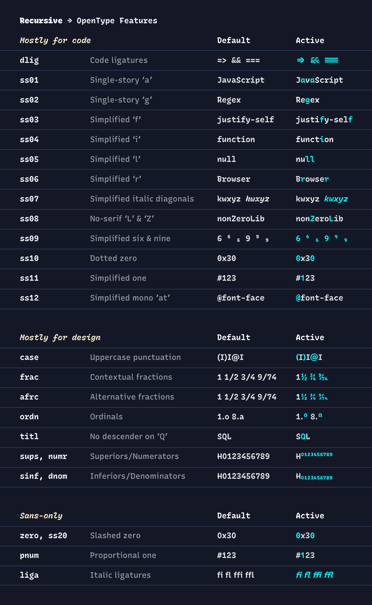

# Customize Recursive for Code

```
#                                             /$$$$$$     /$$                  
#                                            /$$    /    /  /             $$$  
#    /$$$$$$$    /$$$$$$$    /$$ $$$$$    /$$$$$$$$$   /$$$$$      /$$$$$$$ /  
#   /$$_____/   /$$____ $$  | $$$___ $$  |___ $$___/  |___ $$     /$$     $$   
#  | $$        | $$   | $$  | $$   | $$     | $$         | $$    \  $$$$$$$    
#  | $$        | $$   | $$  | $$   | $$     | $$         | $$     \  $$   /    
#  \  $$$$$$$  \  $$$$$$$   | $$   | $$   /$$$$$$$$$  /$$$$$$$$$  / $$$$$$$$   
#   \_______/   \_______/   |__/   |__/  |_________/ |_________/ | $$      $$  
#                                                                \  $$$$$$$$   
#                                                                 \_______/    
```

You can get premade Recursive fonts for Desktop, Web, & Code at https://github.com/arrowtype/recursive/releases/latest. If you are just looking for the premade fonts for code, they are also in this repo within the `fonts` folder. But, if you want to customize your own build of Recursive for Code, you can run the script in this repo!

If you find issues in this customization workflow, please report them in this repo’s [Issues](https://github.com/arrowtype/recursive-code-config/issues).

If you find issues in the fonts themselves, please report them in the [Recursive project Issues](https://github.com/arrowtype/recursive/issues).


## Usage

The basic way to use this tool is to:

1. Clone the repo and install dependencies (you may wish to fork first, so you can save your preferences to GitHub)
2. Configure your font options in `config.yaml`
3. Run the build script

This instantiates custom fonts for Regular, Italic, Bold, and Bold Italic styles, which you can then use in your preferred editor. One VS Code theme that supports Italics is the [Recursive Theme](https://github.com/arrowtype/recursive-theme).


### Prerequisites for this Python project

- To work directly with these examples, you should have [Git set up on your computer](https://help.github.com/en/github/getting-started-with-github/set-up-git).
- To run the font-building script, you must also [Download Python](http://python.org/download/) and install it if you haven’t already.
- This uses a virtual environment to keep installed Python modules contained. If you are used to using node_modules in a JavaScript-based project, it’s somewhat similar to that.

In a terminal, use `cd` to get to a folder you want this project in. Then, clone the repo and move into it:

```
git clone https://github.com/arrowtype/recursive-code-config.git
cd recursive-code-config
```

Then, set up the venv and install requirements:

```bash
python3 -m venv venv             # make a virtual environment called "venv"
source venv/bin/activate         # activate the virtual environment
pip install -r requirements.txt  # install dependencies
```


### 1. Customize your font settings in `config.yaml`

This file uses YAML. Hopefully, it is fairly self-explanatory. If not, file an issue and someone will hopefully help out!

First, specify the family name you want (e.g. `Rec Mono Custom`). 

Then, specify axis values you want for Regular, Italic, Bold, & Bold Italic fonts.

Then, specify whether you want code ligatures on by default. Mark `True` for yes or `False` for no.

Finally, you can copy in the font feature options you want:

```yaml
# These options only have an affect at CRSV<=0.5 (Roman/normal styles)
- ss01 # Single-story a
- ss02 # Single-story g
- ss03 # Simplified f
- ss04 # Simplified i ### NOT CURRENTLY WORKING, see issue #4
- ss05 # Simplified l
- ss06 # Simplified r

# These options affect both Roman & Cursive styles
- ss07 # Simplified italic diagonals (kwxyz)
- ss08 # No-serif L and Z
- ss09 # Simplified 6 and 9
- ss10 # Dotted 0
- ss11 # Simplified 1
- ss12 # Simplified @
```




### 2. Build the fonts!

Build the fonts by running the main Python script in the project:

```bash
source venv/bin/activate         # activate the virtual environment if you haven’t already
python3 scripts/instantiate-code-fonts.py
```

It will build & output fonts to a folder like `RecMono-Custom` (this is affected by whatever custom name you give fonts in config.yaml).

**Building with other config files**

If you wish to build fonts with premade configurations (or reference these), just add their path as an argument:

```bash
python3 scripts/instantiate-code-fonts.py premade-configs/duotone.yaml
```

This argument may also be helpful if you wish to create multiple custom versions. To experiment, just duplicate the `config.yaml` with a new filename, change the `Family Name` option, and run the script pointing to that new config file.

Happy coding!

## Updating to new versions of Recursive (maintainer notes)

Recursive gets periodic updates, and this repo needs to get these updates, as well.

Currently, the process to bring in those updates is pretty simple:

1. Copy the latest variable font (e.g. `Recursive_VF_1.0xx.ttf`) into the `font-data` folder
2. Update the `fontPath` variable in `scripts/instantiate-code-fonts.py` with the latest font path
3. Activate the `venv` and run `scripts/build-all.sh <FONTPATH>` to build updated versions of the fonts

Then, you can run the build according to the instructions above.
